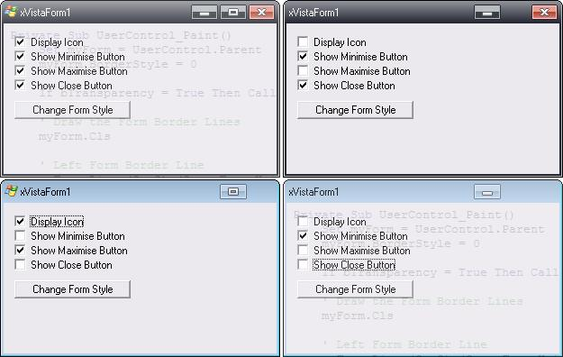



## xVistaForm UserControl

### Description

***UPDATE 12/05/2007*** System Tray menu support for creating user defined menus, added Form Max &amp; Min Height/Width support as per request.

***PREVIOUS UPDATES*** Transparent corners added.

This is an owner drawn Vista Form control that comes with 2 preset styles. It has icon support for 16x16 icons and has transparency support that can be adjusted from 0-100% and also switched on/off. The Minimise, Maximise and Close buttons can all be removed from the Form also. The Form title font can also be changed both in colour and style.

This was only coded since last night and finished off today, so be kind when commenting.

Any issues please let me know, oh and if you download it... you can at least vote for it!!!
 
### More Info
 

             |
---                |---
**Submitted On**   |2007-05-08 19:03:44
**By**             |[Xander75](https://github.com/Planet-Source-Code/PSCIndex/blob/master/ByAuthor/xander75.md)
**Level**          |Intermediate
**User Rating**    |4.6 (153 globes from 33 users)
**Compatibility**  |VB 6\.0
**Category**       |[Custom Controls/ Forms/  Menus](https://github.com/Planet-Source-Code/PSCIndex/blob/master/ByCategory/custom-controls-forms-menus__1-4.md)
**World**          |[Visual Basic](https://github.com/Planet-Source-Code/PSCIndex/blob/master/ByWorld/visual-basic.md)
**Archive File**   |[xVistaForm2065515132007\.zip](https://github.com/Planet-Source-Code/xander75-xvistaform-usercontrol__1-68552/archive/master.zip)

